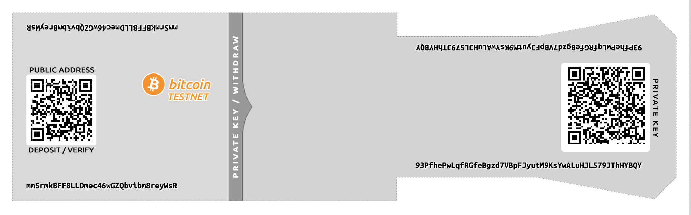
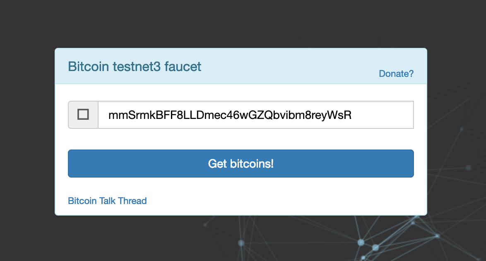
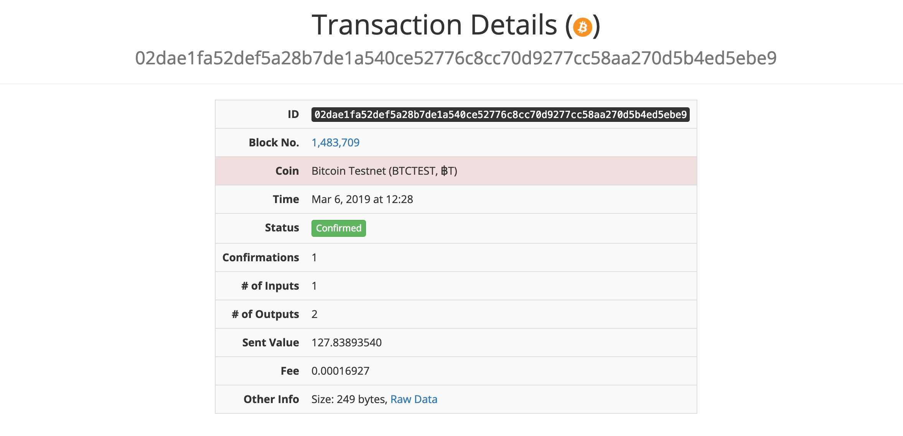
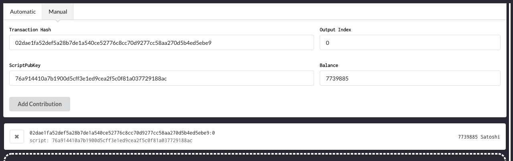
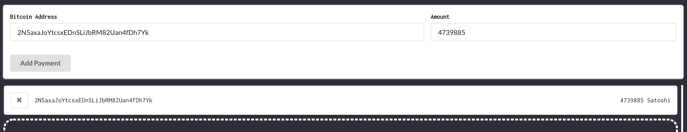
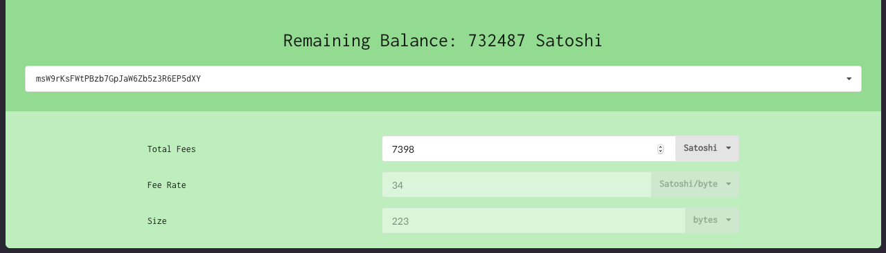

# Constellation: Demystifying Transactions

## Before you start

* I **do not** recommend using this software on the mainnet.
* I **am not** responsible for any loss of bitcoins using this software.
* This software was created for **educational purposes**.
* This software allows the user to create a transaction and analyse the individual steps that went into creating it.

## Guide

Here's a list of step to get you started with creating your own transactions.

### Paper Wallet

Create a paper wallet on the bitcoin testnet using generators like [https://paperwallet.bitcoin.com](https://bitcoinpaperwallet.com/bitcoinpaperwallet/generate-wallet.html?design=alt-testnet#).



Note the following:

* The address (`mmSrmkBFF8LLDmec46wGZQbvibm8reyWsR`) is a P2PKH address.

* The private key (`93PfhePwLqfRGfeBgzd7VBpFJyutM9KsYwALuHJL579JThHYBQY`) is encoded in WIF format (uncompressed).

### Funding

You can use a coin faucet like [https://coinfaucet.eu/](https://coinfaucet.eu/en/btc-testnet/) to get free bitcoins to use on the testnet.



### Block Explorer

Track the progress of your transactions using a block explorer like [chain.so](https://chain.so/). Once you've recieve sufficient confirmations (6) on your transaction, you can then begin spending your funds.



### Transaction Inputs

To add a transaction input manually, we first need some data. To do so, we click on **Raw Data** under the section **Other Info**.

Once you open the **Raw Data** link, you'll arrive at a page filled with JSON data. From this we need to extract:

```JSON
// Transaction Hash
"txid" : "02dae1fa52def5a28b7de1a540ce52776c8cc70d9277cc58aa270d5b4ed5ebe9"

// Output Index
"output_no" : 0

// Locking Script
"script_hex" : "76a914410a7b1900d5cff3e1ed9cea2f5c0f81a037729188ac"

// Balance
"value" : "0.07739885",
```

For the output index, locking script and the balance, we choose the values that correspond to the transaction output of our address. i.e the output that includes
`"address" : "mmSrmkBFF8LLDmec46wGZQbvibm8reyWsR"`.

Then, we simply fill out the form and click add.



### Transaction Outputs

Here, we add the address of our recipient and the amount that we wish to send. Note that only P2PKH and P2SH addresses are valid for recipients. In the picture below I have set the recipient as the address whom I recieved the initial funding from `2N5axaJoYtcsxEDnSLiJbRM82Uan4fDh7Yk`.



### Signing The Transaction

To sign the transaction and thereby prove that we own the funds that we're trying to access, we need to provide the private key that was generated earlier - `93PfhePwLqfRGfeBgzd7VBpFJyutM9KsYwALuHJL579JThHYBQY`.

### Defining Fees

Make use of resources like https://www.buybitcoinworldwide.com/fee-calculator/ to decide on how much to pay in fees. **MAKE SURE THAT YOU DO NOT SET YOUR FEE RATE TOO LOW OR YOUR PAYMENT WILL NOT BE REALISED**.



## Resources

### Fees

* https://www.buybitcoinworldwide.com/fee-calculator/

## Reading Material

To learn more about bitcoin transactions
https://en.bitcoin.it/wiki/Transaction

To learn more about bitcoin scripts
https://en.bitcoin.it/wiki/Script